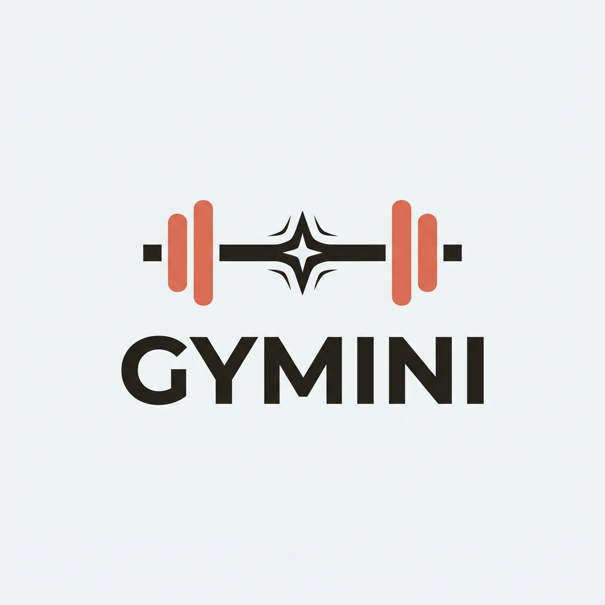
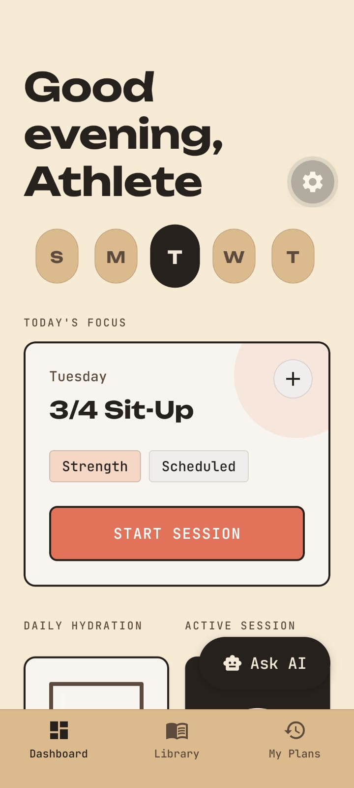
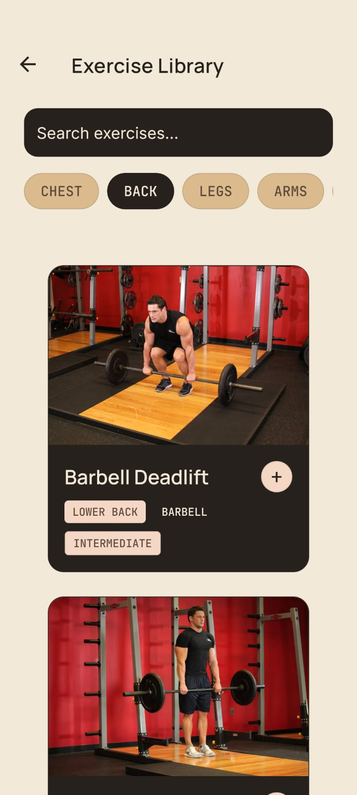
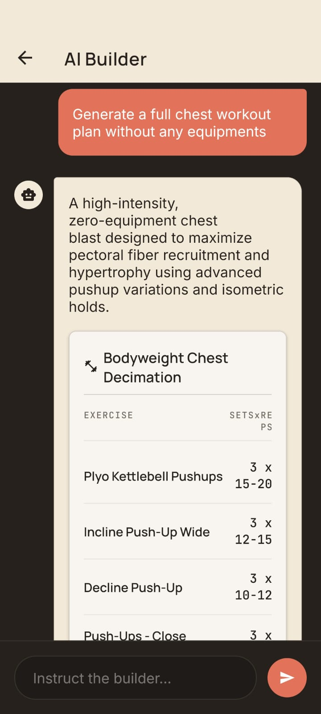

<div align="center">
  

  # 🏋️‍♂️ Gymini
  
  **Your AI-Powered Pocket Personal Trainer.**
  
  [](https://reactnative.dev/)
  [](https://expo.dev/)
  [](https://www.sqlite.org/)
  [](https://deepmind.google/technologies/gemini/)

  *Gymini (Gym + Gemini) leverages Google's Gemini AI and an 800+ exercise offline database to generate perfect, science-backed workout routines tailored exactly to your equipment, goals, and schedule.*
</div>

---

## 📱 Screenshots

<div align="center">
  
  
  

</div>

---

## ✨ Features

- 🧠 **AI Agent Builder:** Stop guessing. Tell the AI your constraints (e.g., *"I have 45 minutes, a pair of dumbbells, and want to hit chest"*), and it will cross-reference its database to output a highly optimized 5-exercise routine.
- 📚 **Massive Offline Library:** Powered by a local SQLite database containing over **800+ exercises**. Includes rich metadata, targeting specific primary/secondary muscle groups, and required equipment.
- ⏱️ **Active Session Tracking:** A dynamic, distraction-free active session UI. 
  - Automatically hides weight inputs for bands and bodyweight movements.
  - Native animated rest timers keep you focused between sets.
- 🗓️ **Smart Dashboard:** View your daily schedules, instantly launch pending workouts, and track your most recent ad-hoc sessions.
- 🎨 **Premium Aesthetics:** Built with a custom design system featuring deep Ink backgrounds, vibrant Ember accents, and smooth micro-animations.

---

## 🚀 Download & Install

You don't need to compile the code to try Gymini! You can download the latest production APK directly.

1. Go to the [Releases Tab](../../releases) on this repository.
2. Download the latest `Gymini-v1.0.0.apk`.
3. Open the file on your Android device to install!

---

## 🛠️ Local Development

Want to compile the app yourself or contribute? It's incredibly easy to get started.

### Prerequisites
- [Node.js](https://nodejs.org/) installed
- [Expo CLI](https://docs.expo.dev/get-started/installation/) (`npm install -g eas-cli`)
- A [Google Gemini API Key](https://aistudio.google.com/)

### Setup

1. **Clone the repository:**
   ```bash
   git clone https://github.com/yourusername/gymini.git
   cd gymini
   ```

2. **Install dependencies:**
   ```bash
   npm install
   ```

3. **Configure Environment Variables:**
   Create a `.env` file in the root of the project and add your Gemini API Key:
   ```env
   EXPO_PUBLIC_GEMINI_API_KEY=your_gemini_api_key_here
   ```

4. **Start the Expo server:**
   ```bash
   npm run start
   ```
   *Scan the generated QR code with the Expo Go app on your phone, or press `a` to run on an Android emulator!*

---

## 🏗️ Architecture & Tech Stack

- **Framework:** React Native + Expo
- **Database:** `expo-sqlite` (Local Offline Database)
- **AI Integration:** Google Gemini REST API (via `fetch`)
- **Navigation:** React Navigation (Native Stack)
- **Styling:** Custom StyleSheet Design System (Vanilla RN)

## 🙏 Acknowledgments & Data Sources

The massive 800+ exercise database powering Gymini's offline library and AI matching engine was derived from the incredible open-source database [exercise.json](https://github.com/wrkout/exercises.json) by [OllieJennings](https://github.com/wrkout/exercises.json/commits?author=OllieJennings).

## 📄 License

This project is licensed under the MIT License - see the [LICENSE](LICENSE) file for details.
